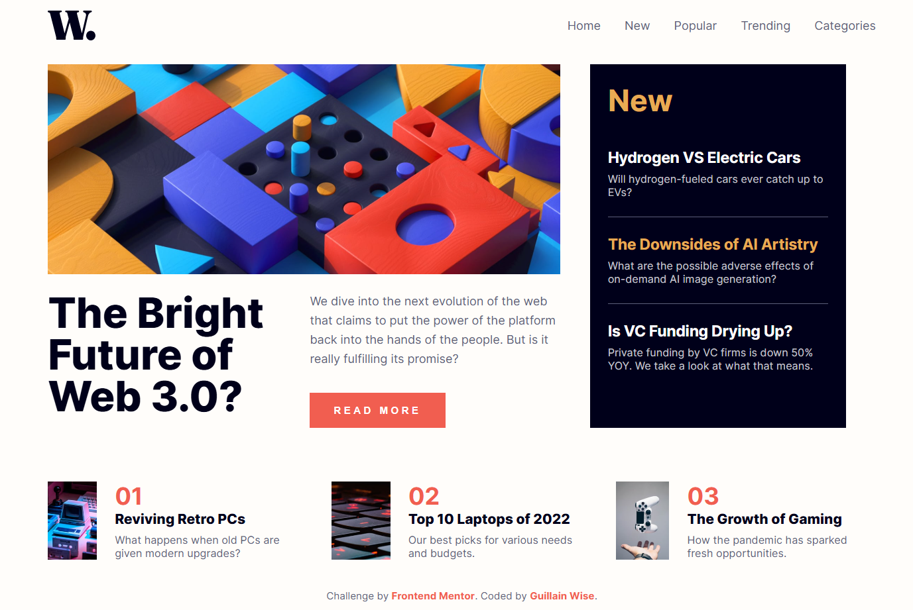

# Frontend Mentor - News homepage solution

This is a solution to the [News homepage challenge on Frontend Mentor](https://www.frontendmentor.io/challenges/news-homepage-H6SWTa1MFl). Frontend Mentor challenges help you improve your coding skills by building realistic projects. 

## Table of contents

- [Overview](#overview)
  - [The challenge](#the-challenge)
  - [Screenshot](#screenshot)
  - [Links](#links)
  - [Built with](#built-with)
  - [What I learned](#what-i-learned)
  - [Continued development](#continued-development)
  - [Useful resources](#useful-resources)
- [Author](#author)
- [Acknowledgments](#acknowledgments)

## Overview
This "News homepage" project is a responsive, single-page web application built using semantic HTML5, Vanilla CSS, and a small amount of JavaScript. The layout is primarily driven by CSS Grid for the complex multi-column structure and Flexbox for individual components like the navigation bar and article lists. It features a fully responsive design with a mobile-first approach, including a hamburger menu toggle for smaller screens and scroll-triggered animations powered by the Intersection Observer API, which adds an in-view class to key sections as the user scrolls. The project maintains a consistent aesthetic through the use of CSS Custom Properties (CSS variables) for colors and typography, ensuring a clean and modern user experience.

### The challenge

Users should be able to:

- View the optimal layout for the interface depending on their device's screen size
- See hover and focus states for all interactive elements on the page

### Screenshot



### Links

- Solution URL: [Click here](https://www.frontendmentor.io/solutions/news-home-page-tnOmblcd6Z)
- Live Site URL: [Click here](https://freedev-group.github.io/News-homepage-wise/)


### Built with

- Semantic HTML5 markup
- CSS custom properties
- Flexbox
- CSS Grid
- Mobile-first workflow
- Vanilla JavaScript

### What I learned

During this project, I focused on creating a complex grid layout that adapts seamlessly between mobile and desktop views. Using CSS Grid allowed for elegant control over the placement of the "Hero" section, the "New" sidebar, and the "Top List" articles.

I also implemented a smooth mobile navigation menu using a combination of CSS transitions and a small amount of JavaScript to toggle visibility.

Another key learning was using the `Intersection Observer API` to trigger animations when elements enter the viewport:

```js
const observer = new IntersectionObserver((entries) => {
  entries.forEach(entry => {
    if (entry.isIntersecting) {
      entry.target.classList.add('in-view');
    } 
  });
}, observerOptions);

document.querySelectorAll('.hero, .new-articles, .list-item').forEach(section => {
  observer.observe(section);
});
```

### Continued development

In future projects, I want to further explore:
- More advanced CSS Grid techniques like `grid-template-areas` for even cleaner layout code.
- Fine-tuning performance for animations triggered by the Intersection Observer.
- Improving accessibility, especially for interactive elements like the mobile menu toggle.

### Useful resources

- [MDN Web Docs - CSS Grid Layout](https://developer.mozilla.org/en-US/docs/Web/CSS/CSS_Grid_Layout) - Essential for understanding how to structure the multi-column layout.
- [A Complete Guide to Flexbox](https://css-tricks.com/snippets/css/a-guide-to-flexbox/) - My go-to reference for centering and aligning elements in the navbar and list items.


## Author

- Frontend Mentor - [@Guillain Wise](https://github.com/guillainwise-glitch)
- Coded by Guillain Wise

## Acknowledgments

Thanks to Frontend Mentor for the amazing design and challenge.
